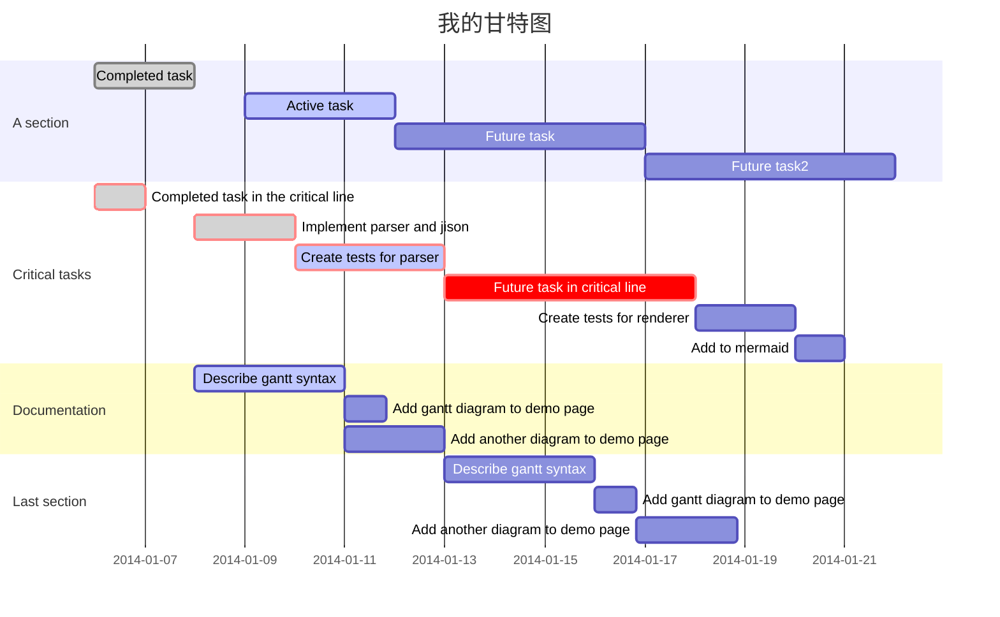
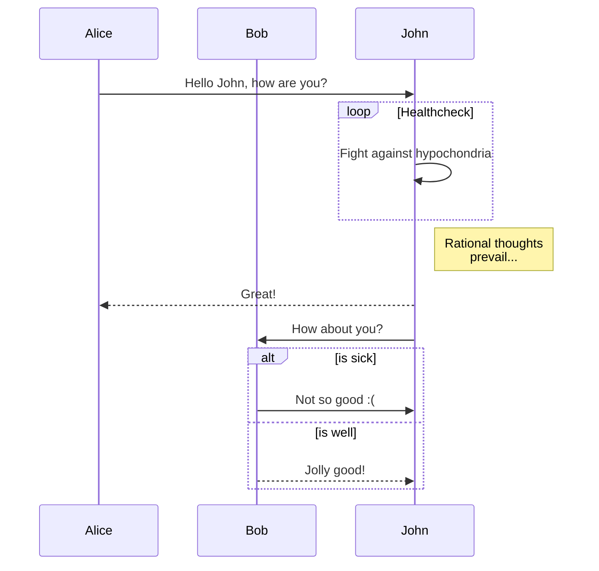
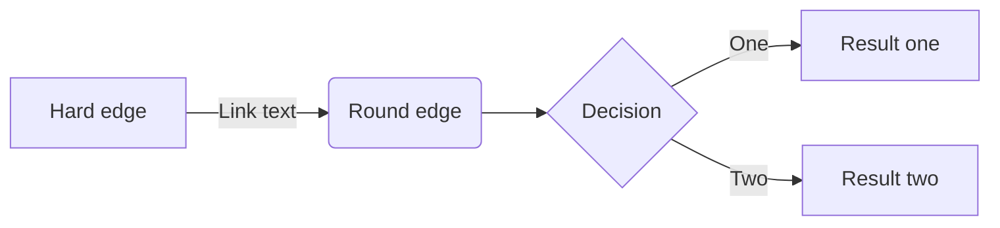
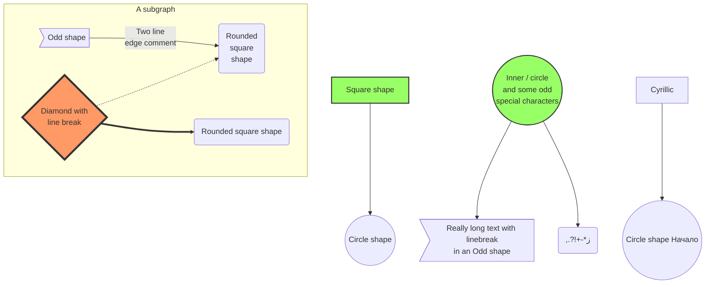

Welcome to 5dw, the 5 dimention network!

# 欢迎使用BookPad! :) ;)

> 请先预览本页! 
感谢您选择BookPad!如果您发现任何问题，欢迎到Windows应用商店中给我们提出您宝贵的意见，我们会尽快修复！

本页是您在**BookPad**[^bookpad]中的第一个Markdown文档。如果您是第一次使用，本页将会对您十分有用，因为在这里您会看到**BookPad**的使用方法。 :fa-glass:
[^bookpad]: **BookPad** 是一个简单但又功能全面的Markdown编辑器。 

----------

## :fa-cog spin: 用法

**BookPad**会把您的文档保存在它自己的本地目录中，您可以导入已有的文档或目录从而可以在统一的地方管理它们。

> **注：**
> - **BookPad**会在退出时自动保存您的文档不管您之前是否已经保存过，此外您还可以设置每30秒自动保存，但是为了您的数据的安全，我们还是建议您定期手动保存 :fa-save:。
> - 您的文档不会自动在不同的电脑之间同步，如果需要您可以把他们导出然后手动拷备到您需要的电脑上。或者您也可以使用任何云同步软件来同步您电脑中的任何目录，然后指定它为BookPad的根目录，这样您的文档将自动被云同步软件同步。
> - 如果您使用的是BookPad内部根目录，卸载**BookPad**将会**删除BookPad中您所有你的本地文档！** 请确保在卸载前您的文档已经导出并妥善保存，或使用的是外部根目录。但是……为什么不留着**BookPad**呢？它会派上用场的！ :fa-thumbs-o-up: :fa-smile-o: :fa-thumbs-o-up: :fa-sun-o: :fa-hand-rock-o: :fa-hand-peace-o:
> - 如果您使用的是BookPad内部根目录，在使用过程中需要修改Window 10的语言或区域设置，请***务必***在修改之前将您所有的文档和目录导出，之后再重新导入。否则您将无法在修改之后看到你的任何文档！
> - 默认状态下一些高级语法被关闭，如果要使用，请在设置界面中启用。===但需要注意，如果同时启用实时预览和这些高级语法（特别是mermaid），性能可能会有所下降。===（非常抱歉！之后的版本中我们会尽快改进）

### :fa-file: 创建新文档

您可以通过 *`新建`* 菜单或是`Ctrl + N`快捷键来创建新的文档，只不过这种方式创建的文档将会被保存在您的文档根目录下。如果您想在某个特定的目录里新建文档，您可以在文档列表页面右击一个目录，然后选择 *`新文档`*。

另一种创建新文档的方式是，您可以先创建一个大纲文档，在里面添加任何您想要的链接到其他本地文档，而这些其他的本地文档是可以不存在的，当您在预览中点击这些链接的时候BookPad会自动帮助您在合适的目录下创建它们。这种方式在编辑多个相关的文档的非常有用。

### :fa-folder: 创建一个新目录

在文档列表中，您可以通过右击一个目录并选择 *`子文件夹`* 菜单来创建一个子目录。

在通过链接创建文档的时候，如果他们所在的目录不存在BookPad也会自动帮助创建。

### :fa-refresh: 打开不同的文档

您可以在文档列表页面双击一个文档来打开它。
文档列表页面可以通过 *`打开`* 菜单或是`Ctrl + O`快捷键来打开。

您也可以通过快捷键`Ctrl + Shift + O`[^打开文件]来打开一个外部的文档。但是在编辑外部文档的时候有一些功能上的限制，比如，你不能向文档里面`粘贴`图片，而只能手去指定`BookPad根目录下`已存在图片的路径。

[^打开文件]: 您可以在任何.md文件上点击右键选择用BookPad打开，或直接设置BookPad为此种文件的默认打开应用，这样以后您就可以通过双击.md文件来打开它。

### :fa-save: 保存文档

您可以通过 *`保存`* 菜单或是`Ctrl + S`快捷键来保存文档，也可以通过`Ctrl + Shift + S`快捷键来把当前文档保存到BookPad根目录之外的任何目录下。但同样，保存到外部之后将不能直接粘贴图片到文档里面，而需要手动填写`BookPad根目录下`已存在图片的路径。

### :fa-pencil: 重命名文档

您可以通过在文档列表页面中右击一个文档或目录并选择 *`重命名`* 来重命名一个文档或目录，也可以用`F2`快捷键来实现相同的功能。

### :fa-trash-o: 删除文档

您可以通过在文档列表页面右击一个文档或目录并选择 *`删除`* 来删除它，也可以用`Delete`快捷键来实现相同的功能。

### :fa-share: 导出文档

您可以通过在菜单中选择 *`导出`* 然后在自动打开的文档列表页面中双击一个文档或目录来导出一个文档或目录。

和保存到外部不同，导出只是把文档或目录导出到指定目录，但并不影响当前正在编辑的文档。用`Ctrl + Shift + S`保存到外部之后当前编辑文档将是新保存的外部文档。

### :fa-globe: 预览文档

您可以通过 *`预览`* 菜单或快捷键`Ctrl + P`来预览当前文档。也可以通过`Ctrl + Shift + P`来切换是否显示实时预览。

### :fa-gears: 设置

在设置页面，您可以修改多种配置参数来控制您的BookPad的行为方式。您可以通过 *`设置`* 菜单或快捷方式`Ctrl + K`打开设置页面。

### :fa-bolt: 快捷键

下面列出了**BookPad**支持的所有快捷键（==如果你所用的输入法在使用相同的快捷键，请修改输入法设置，否则BookPad中相应的键将失效==）:

#### 应用操作
* 显示主菜单： `Ctrl + ` :fa-windows:
* 新建文档： `Ctrl + N`
* 打开文档： `Ctrl + O`
* 打开外部文档： `Ctrl + Shift + O`
* 保存文档： `Ctrl + S`
* 保存文档到外部： `Ctrl + Shift + S`
* 预览文档： `Ctrl + P`
* 切换实时预览： `Ctrl + Shift + P`
* 导入文档： `Ctrl + Alt + I`
* 导入目录： `Ctrl + Shift + I`
* 导出： `Ctrl + E`
* 设置： `Ctrl + K`
* 增大编辑器字体： `Ctrl + +`或`Ctrl + 鼠标滚轮上滑`
* 缩小编辑器字体： `Ctrl + -`或`Ctrl + 鼠标滚轮下滑`
* 帮助： `F1`
* 编辑器前一个样式： `Ctrl + Up`
* 编辑器后一个样式： `Ctrl + Down`
* 编辑器默认样式： `Ctrl + Enter`
* 预览前一个样式： `Alt + Up`
* 预览后一个样式： `Alt + Down`
* 预览默认样式： `Alt + Enter`
* 预览代码前一个样式： `Shift + Alt + Up`
* 预览代码后一个样式： `Shift + Alt + Down`
* 预览代码默认样式： `Shift + Alt + Enter`

#### 编辑器相关
* 全选： `Ctrl+ A`
* 删除当前行： `Ctrl + D`
* 搜索： `Ctrl + F`
* 搜索下一个： `Ctrl + G`
* 搜索上一个： `Ctrl + Shift + G`
* 持续搜索： `Alt + F`
* 替换： `Ctrl + Shift + F`
* 全部替换： `Ctrl + Shift + R`
* 跳到行: `Alt + G` 
* 撤销选中： `Ctrl + U`
* 重新选中： `Alt + U`
* 重做： `Ctrl + Y`
* 撤销： `Ctrl + Z`
* 向后缩进前前行： `Ctrl + ]`
* 向前缩进当前行： `Ctrl + [`
* 跳到文档开头： `Ctrl + Home`
* 跳到文档结尾： `Ctrl + End`
* 跳过前一个词： `Ctrl + Left`
* 跳过后一个词： `Ctrl + Right`
* 跳到本行开头： `Alt + Left`
* 跳到本行结尾： `Alt + Right`
* 删除前一个词： `Ctrl + Backspace`
* 删除后一个词： `Ctr + Delete`
* 向后缩进： `Tab`
* 向前缩进： `Shift + Tab`
* 切换显示行号： `Ctrl + Shift + L`
* 切换显示工具栏： `Ctrl + Shift + T`

#### 编辑器工具栏和Markdown语法
* 粗体： `Ctrl-B`
* 斜体： `Ctrl-I`
* 表格： `Ctrl-T`
* 标题： `Ctrl-H`
* 饮用： `Ctrl-'`
* 链接： `Ctrl-L`
* 水平线： `Ctrl-R`
* 下标： `Alt-,`
* 上标： `Alt-.`
* 下划线： `Ctrl-Alt-U`
* 代码： `Ctrl-Alt-'`
* 图片： `Ctrl-Alt-L`
* 脚注： `Ctrl-Alt-N`
* 图标： `Ctrl-Alt-：`

----------

## Markdown语法
您可以在[这里](4)找到更多关于Markdown语法的内容。

### 基本语法
#### 标题
># 这是一号标题H1
>## 这是二号标题H2
>### 这是三号标题H3
>#### 这是四号标题H4
>##### 这是五号标题H5
>###### 这是六号标题H6
> 这不是标题而是正文内容。

#### 强调
斜体 = 两边分别加一个 `*` 或 `_`；
粗体 = 两边分别加两个 `*` 或 `_`；
粗体加斜体 = 两边分别加三个 `*` 或 `_`；
删除线 = 两边分别加两个 `~`；
上标 = 两边分别加一个 `~`；
下标 = 两边分别加一个 `^`；
下划线 = 两边分别加两个以上 `+`；
着色 = 两边分别加两个以上 `=`；
定义缩写 = `*[缩写]`；
下面是一个列子：

>*一个星号斜体*
>_一个下划线斜体_
>**两个星号粗体**
>__两个下划线粗体__
>***三个星号粗体加斜体***
>___三个下划线粗体加斜体___
>~~删除我~~
>M~x~
>X^3^
>++你好吗？++
>请 ==不要== 卸载 BookPad
>
>*[HTML]: 超文本链接标示语言
>BookPad可以以 HTML 来预览格式化结果，在预览模式下你可以把鼠标放在 HTML 上来看它的定义。


#### 引用
> 这是一个包含两个段落的引用。
> 在每个段落里都有多行内容。
> 
> 这是一个包含两个段落的引用。
> 在每个段落里都有多行内容。

#### 列表
可以在行的最前面放一个 `*`, `+` 或 `-`来表示无序列表：
*   [x] 红色
*   [x] 绿色
*   [ ] 蓝色
    * 深蓝色
    * 浅蓝色

等同于：

+   [x] 红色
+   [x] 绿色
+   [ ] 蓝色

也等同于：

-   [x] 红色
-   [x] 绿色
-   [ ] 蓝色

有序列表用数字加一个点号来表示：

1.  第一项
2.  第二项
    1. 子项 2.1
8.  第三项（虽然前面写的是8）
    1. 子项 3.1

#### 水平线
你可以通过将三个或更多的短横线、星号或下划线放在单独的一行来产生一个水平线。如果你愿意，你可以它们之间加入空格。下面的每一行都会产生一个相同水平线：

**********************************
* * *
----------------------------------
-  -  - 
__________________________________
_ _ _

#### 链接
我常用的搜索引擎有： [谷歌](http://www.google.com), [必应](http://www.bing.com) 和 [百度](http://www.baidu.com).
我常用的搜索引擎有： [谷歌][1], [必应][2] 和 [百度][3].
我常用的搜索引擎有： [谷歌][谷歌], [必应][必应] 和 [百度][百度].
我常用的搜索引擎有： [谷歌][], [必应][] 和 [百度][].
我常用的搜索引擎有： <http://www.google.com>, <http://www.bing.com> 和 <http://www.baidu.com>.

然后你可以定义下面的链接，并把它们放在文档中任何你希望的地方。它们不会直接显示出来，而是只会被上面的链接所使用。

[1]: http://www.google.com/        "谷歌"
[2]: http://www.bing.com/ 	"必应"
[3]: http://www.baidu.com/   	 "百度"

[谷歌]: http://www.google.com/ "谷歌"
[必应]: http://www.bing.com/ 	 "必应"
[百度]: http://www.baidu.com/   	 "百度"

#### 反斜杠
Markdown里面可以使用反斜杠转意下面的字符（因为它们有特别的含义，所以当你希望看到它们本身的时候需要转意）:
* \\   反斜杠
* \`   反引号
* \*   星号
* \_   下划线
* \{\}  大括号
* \[\]  中括号
* \(\)  小括号
* \#   井号
* \+   加号
* \-   减号
* \.   点号
* \!   惊叹号

#### 内嵌HTML
对于任何没有被Markdown语法与重新定义的HTML内容你都可以在Makdown文档中直接使。你不需要加特别的标记来告诉解析器你是在使用Markdown还是在使用HTML。你需要的只是HTML标签本身。

唯一需要注意的是那些像\<div\>, \<table\>, \<pre\>, \<p\>等的块标签需要在前后加上一个空行，并且开头和结束标签本身前面没有空格或tab键。Markdown不会再自动在这些块标签前后加上多余的\<p\>。

例如你可以直接在Markdown文档中使用下面的HTML来画一张表：


<table>
    <tr>
        <td>一些内容</td>
        <td>一些内容</td>
        <td>一些内容</td>
    </tr>
	<tr>
        <td>一些内容</td>
        <td>一些内容</td>
        <td>一些内容</td>
    </tr>
    <tr>
        <td>一些内容</td>
        <td>一些内容</td>
        <td>一些内容</td>
    </tr>
</table>

### Markdown扩展语法

#### 自动目录

===在设置界面中启用自动目录后===，你可以在文档的任何位置使用 `[TOC]`来插入自动目录，但这个标记需要自己占用单独的一行：

   [TOC]

#### 术语定义列表

术语 1
术语 2
:   这是第一种定义 A
:   这里是第二种定义 B

术语 3
:   这里是第一种定义 C
:   这里是第二种定义 D
> 这是定义D的一部分

#### 表格
配件		| 价格
------	| ---
主板		| 5000￥
键盘		| 200￥
显示器	| 2000￥

你可以用**半角**冒号来使用列对齐：

| 配件		| 价格		|数量	|
| :------		| ---:		|:---:	|
| 主板		| 5000￥	| 80	|
| 键盘		| 200￥		| 200	|
| 显示器	| 2000￥	| 100	|


#### 代码高亮
===你需要在设置界面中启用代码高亮。===

``` 
/* HelloWorld.java
 */

public class HelloWorld
{
	public static void main(String[] args) {
		System.out.println("Hello World!");
	}
}
```

``` python
#!/usr/bin/python
# Say hello, world.
print "Hello, world!"
```

```
<!DOCTYPE html>
<title>Title</title>

<style>body {width: 500px;}</style>
<script type="application/javascript">
  function $init() {return true;}
</script>

<body>
  <p checked class="title" id='title'>Title</p>
  <!-- here goes the rest of the page -->
</body>
```

#### 数学公式
===在设置界面中启用数学公式后===，**BookPad**支持用**MathJax**来显示*LaTeX*格式的数学公式。你在 [这里][5] 可以找到更多的信息。比如：

满足 $\Gamma(n) = (n-1)!\quad\forall n\in\mathbb N$ 的*伽马方程*需要通过积分求解：

$$
\Gamma(z) = \int_0^\infty t^{z-1}e^{-t}dt\,.
$$

#### 时序图
===你需要在设置界面中启用时序图。===

```diagram
张三->李四: 你好啊，张三
Note right of 李四: 呵呵
李四-->张三: 挺好的，你呢？
```

#### 流程图
===你需要在设置界面中启用流程图。===

```flow
st=>start: 开始
e=>end: 结束
op=>operation: 我的操作
cond=>condition: 是 或 否?

st->op->cond
cond(yes)->e
cond(no)->op
```

#### 支持Mermaid图
从2.2版本，BookPad开始支持Mermaid语法的图表，但默认是关闭状态，===你需要在设置界面中启用它后才能使用===。

##### 使用mermaid画甘特图



##### 使用mermaid画时序图



##### 使用mermaid画流程图




##### 带有格式的mermaid流程图


> **注：** 你可以在下面的链接中找到更多的内容：
> - 关于 **时序图** 的语法在[这里][6],
> - 关于 **流程图** 的语法在[这里][7],
> - 关于 **Mermaid** 的语法在[这里][11]。

#### 嵌入图片
你可以在Markdown文档的任何位置插入一个外部或本地的图片, 还可以像下面所示用`{200}`指定图片高和宽都为`200`，或用`{200x400}`来指定图片高为`200`，宽为`400`。如果不指定，图片会以默认大小显示：


> 如果您想在当前文档中插入一个已经存在的本地图片，您可以打开文档列表，右键点击相应的图片文件，然后选择`插入链接`, 您可以对其他类型的文件做相同的事情，但他们会被插入为普通链接。

#### 脚注

你可以像这样创建一个脚注[^我的脚注].

  [^我的脚注]: 这里是*我的脚注*的具体内容，这一行脚注将会被自动放在整个文档的最后。

## 嵌入图标
**BookPad**支持font awesome图标[8]，stack icons图标[9]和Glyphicon图标[10]和Emoji四种图标。比如下面是BookPad简化用法：

:gl-asterisk: :fa-address-book spin pull-right:
:fa-bath 3x: ;) :pizza: :st-addthis r5:

您当然也可以直接插入HTML的方法插入同样的图标，比如：
<i class="fa fa-address-book fa-spin fa-2x"></i>

>您可以使用下面的修饰符还修饰font awesome图标 (`:fa-*:`):
>* lg
>* 2x
>* 3x
>* 4x
>* 5x
>* fw
>* ul
>* border
>* pull-left
>* pull-right
>* spin
>* pulse
>* rotate-90
>* rotate-180
>* rotate-270
>* flip-horizontal
>* flip-vertical
>* stack
>* stack-1x
>* stack-2x
>* inverse

>您可以使用下面的修饰符还修饰stack icons图标 (`:st-*:`):
>* r0
>* r1
>* r2
>* r3
>* r4
>* r5

[4]: http://daringfireball.net/projects/markdown/syntax
[5]: http://meta.math.stackexchange.com/questions/5020/mathjax-basic-tutorial-and-quick-reference
[6]: http://bramp.github.io/js-sequence-diagrams/
[7]: http://adrai.github.io/flowchart.js/
[8]: http://fontawesome.io/
[9]: http://stackicons.com/
[10]: http://glyphicons.com/
[11]: https://mermaidjs.github.io/
