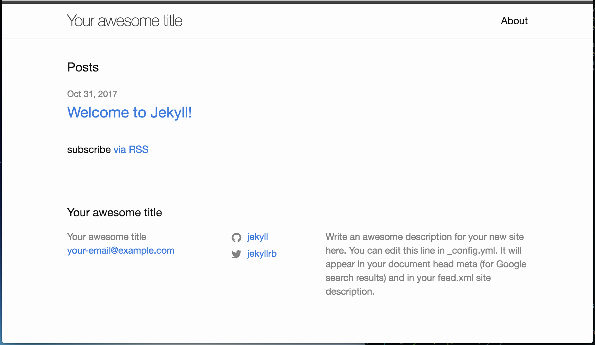

> * 在Github里面我们可以存储和管理代码，同样也可以存储文章。
> * Github的Page功能出来之后例我们可以用存储在其上的内容来构建自己的网站。
> * Github Page支持Jekyll，所以我们可以使用Jekyll更轻松地搭建自己的博客网站。
> * 我们可以使用Markdown语言来写文章，在Github Page上展示。
> * Github帮助我们存储和管理我们的文章，Jekyll帮助我们本地调试网站。

本网站就是用这种方法搭建而成，您可以通过探索本站得到这种方式可以达到的效果。

# Jekyll安装和尝试
> Jekyll不是必须的。但是它可以在本地启动一个服务器让你不需要上传内容就可以看到效果，从而帮助你调试网站，直到满意，才把内容上传到Github上去。这可以节省不少的时间。

## 下载和安装Jekyll
你可以从Jekyll的网站([英文](http://jekyll.com/)或[中文](http://jekyll.com.cn/))上得到所有需要的信息。但这里简单介绍一下必须的步骤。
1. 官方不建议在Windows下安装Jekyll，虽然你可以做到。这里建议，如果你用的是Windows系统，那么你可以跳过Jekyll部分，因为没有它你一样可以成功搭建你的网站，只不过不能本地调试而已。这里以Macbook为例。
2. 通过命令`gem install jekyll`来安装jekyll
3. 通过命令`jekyll new first`来创建自己的本地网站。这里‘first’是网站名，也是本地目录的名字，你可以随便用任何你想用的名字。
4.

# Github注册
# Git用法
# 选择现成模板
# 一般问题
